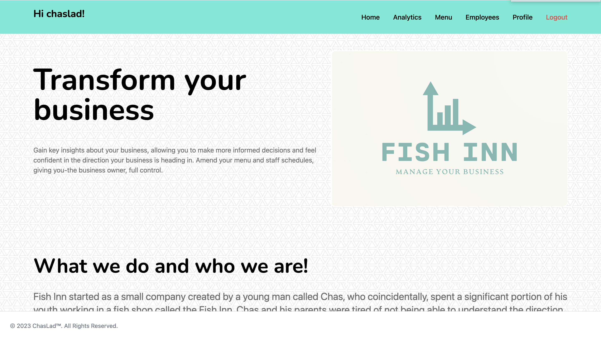

# Fish-Inn
## Full stack web app for a Fish Shop!
This application uses the PERN (PostgreSQL, Express.JS, React, Node.JS) data stack to create a web app to
be used by a takeaway. This application is supposed to be used from a business owner's perspective, and will provide key insights and management on topics such as sales, customers, employee shift scheduling, menu items, offers and reviews.

### Login

### Homepage

### View Analytics

### Edit Menu

### Edit Employee List

### Edit Employee Rota

### Edit Profile

